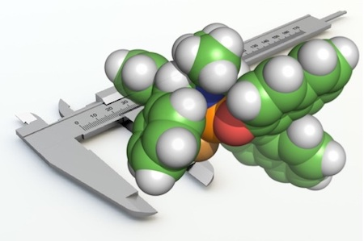

# Sterimol.py

A commandline Python program for the calculation of multi-dimensional [Sterimol](http://www.ccl.net/cca/software/SOURCES/FORTRAN/STERIMOL/) parameters: L, B1 and B5 for half-sandwich complexes and organic molecules. If used on half-sandwich complexes, it also generates [Tolman cone angles](https://en.wikipedia.org/wiki/Ligand_cone_angle) and metal to ring-centroid (unweighted) distances. The results have been validated against the original Fortran77 code compiled with gfortran on OSX v10.11.3 27/03/2016.

Developed by Dr Kelvin Jackson (University of Oxford) and [Robert Paton](http://wwww.patonlab.com) at Colorado State University.



This code is no longer actively supported. We recommend using [wSterimol](https://github.com/bobbypaton/wSterimol/) which provides expanded functionality for flexible substituents and a graphical interface through [PyMol](https://pymol.org/2).


#### Installation
1. Download the scripts from https://github.com/bobbypaton/Sterimol
2. Add the directory of the scripts to the PATH environmental variable (optional).  
3.	Run the script with Gaussian input or output files.

#### Correct Usage

##### For half-sandwich complexes

```
sterimol.py file(s)
```
* This program will read Gaussian input or output files or half-sandwich complexes.


##### For organic molecules

```
sterimol.py (-a1 atom A) (-a2 atom B) (-radii radius-model) file(s)
```
* `-a1` and `-a2` specify atoms A and B atoms for the calculation - these fields are mandatory as they specify the axis along which Sterimol parameters are calculated.
* The `-radii` option specifies the radial model used; it may be set to `-radii bondi` or `-radii cpk` for either van der Waals radii from [Bondi](http://pubs.acs.org/doi/abs/10.1021/j100785a001) or [CPK](https://en.wikipedia.org/wiki/Space-filling_model). If left blank, the default setting uses the original CPK radii.


#### Example 1:
Calculating Tolman cone angles, metal to ring-centroid distances, and Sterimol parameters for a half-sandwich complex from a Gaussian output file.

```
python sterimol.py examples/RhCpMe5Cl2PMe3.log

Sandwich Analysis
STERIMOL: using original CPK Van der Waals parameters

Structure                 Tolman_CA   MC_dist         L        B1        B5
RhCpMe5Cl2PMe3.log           173.97     1.833     4.016     3.902     4.304
```

The output shows the tolman cone angle (in degrees) and metal to centroid distance, L, B1 and B5 (all in Angstrom). Cone angles and Sterimol parameters are calculated using the original CPK atomic radii.

#### Example 2:
Calculating Sterimol parameters for an organic functional group (e.g. *tert*-butyl) from a Gaussian-formatted input file.

```
python sterimol.py -a1 2 -a2 1 examples/tBu.com

   STERIMOL: using original CPK Van der Waals parameters
   Atoms 1 and 2 define the L-axis and direction [ 1.1  0.   0. ]

   Atom       Xco/A     Yco/A     Zco/A    VdW/pm
   ##############################################
   H          0.000     0.000     0.000     100.0
   C         -1.100     0.000     0.000     150.0
   C         -1.610     1.030     1.030     150.0
   H         -2.710     1.030     1.030     100.0
   H         -1.250     0.760     2.030     100.0
   H         -1.250     2.030     0.760     100.0
   C         -1.610     0.380    -1.400     150.0
   H         -2.710     0.380    -1.400     100.0
   H         -1.250     1.380    -1.670     100.0
   H         -1.250    -0.360    -2.140     100.0
   C         -1.610    -1.400     0.380     150.0
   H         -2.710    -1.400     0.380     100.0
   H         -1.250    -2.140    -0.360     100.0
   H         -1.250    -1.670     1.380     100.0

   Structure                      L        B1        B5
   examples/tBu.gjf            4.11      2.76      3.17
```

The output in this case returns the element types, Cartesian coordinates and atomic radii according to the CPK radial definitions. The Sterimol parameters for the structure are underneath; L, B1 and B5 are all given in Angstroms.

#### Example 3:
Calculating parameters for a dimeric half-sandwich complex from a Gaussian output file.

```
python sterimol.py examples/Rh_AsymmetricDimer.log

Sandwich Analysis
STERIMOL: using original CPK Van der Waals parameters

   Structure                 Tolman_CA   MC_dist         L        B1        B5
   Rh_AsymmetricDimer.log      191.283     1.763     6.184     3.381     5.607
   Rh_AsymmetricDimer.log      190.174     1.766     6.239     3.386     5.608
```

In this example two sets of parameters are produced - this occurs when the dimeric complex does not have a symmetry plane and thus measurements from each of the two metal centres yields different results. In the case of symmetric dimers, only a single set of parameters is generated (as they would be the same when measured from either metal centre).


**Tips and Troubleshooting**
* Errors will occur if this program is used on systems containing atoms for which there are no CPK defined radii.
* When running on organic molecules, the directionality of `-a1` and `-a2` is important - make sure the `-a1` to `-a2` vector is pointing towards the functional group being measured.
* It is possible to run on any number of files at once, for example using wildcards to specify all of the Gaussian files in a directory (*.out)
* The python file doesn’t need to be in the same folder as the Gaussian files. Just set the location of sterimol.py in the `$PATH` variable.

#### Papers citing Sterimol.py
1. *Correlating Reactivity and Selectivity to Cyclopentadienyl Ligand Properties in Rh(III)-Catalyzed C-H Activation Reactions: an Experimental and Computational Study* Piou, T.; Romanov-Michailidis, F.; Romanova-Michaelides, T.; Jackson, K. E.; Semakul, N.; Taggart, T. D.; Newell, B S.; Rithner, C. D.; Paton, R. S.; Rovis, T. *J. Am. Chem. Soc.* **2017** *139*, 1296–1310[DOI: 10.1021/jacs.6b11670](http://dx.doi.org/10.1021/jacs.6b11670)
2. *Improved correlation between animal and human potency of non-steroidal anti-inflammatory drugs using quantitative structure–activity relationships (QSARs).* Dearden, J.;  Hewitt, M. M.; Bresnen, G. N.; Gregg, C. SAR and QSAR in Environmental Research. **2017**, *28* 1-9[DOI: 10.1080/1062936X.2017.1351391](http://dx.doi.org/10.1080/1062936X.2017.1351391)
3. *Enantiodivergent Pd-catalyzed C–C bond formation enabled through ligand parameterization* Zhao, S.; Gensch, T.; Murray, B.; Niemeyer, Z. L.; Sigman, M. S.; Biscoe, M. R. *Science* **2018**, *eaat2299* [DOI: 10.1126/science.aat2299](http://dx.doi.org/10.1126/science.aat2299)

#### References for the underlying theory
1. Verloop, A. Drug Design Vol. III, Academic P.; Ariens, E. J., Ed.; 1976.

[](https://zenodo.org/badge/latestdoi/55379766)
---
License: [CC-BY](https://creativecommons.org/licenses/by/3.0/)
